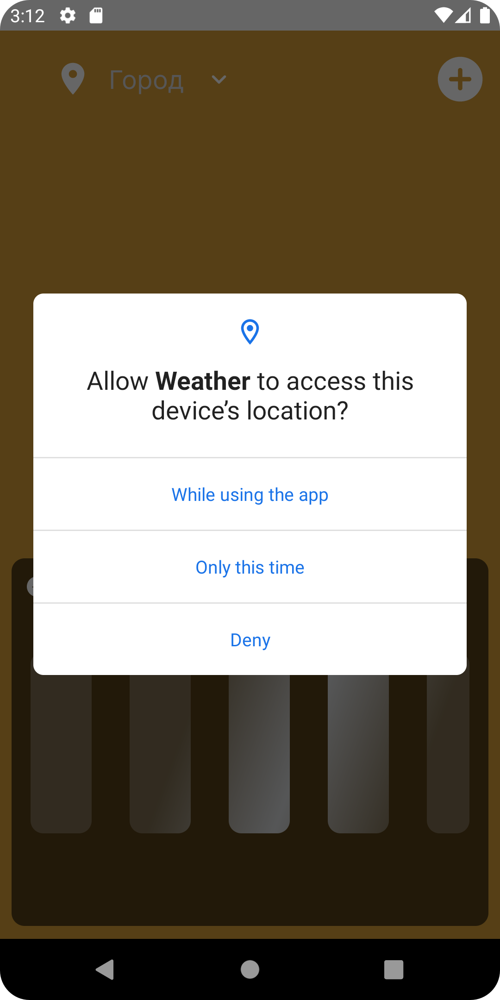
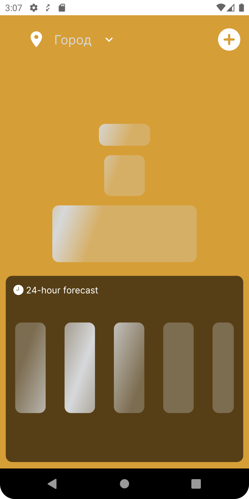
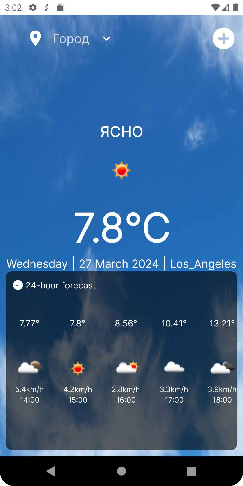
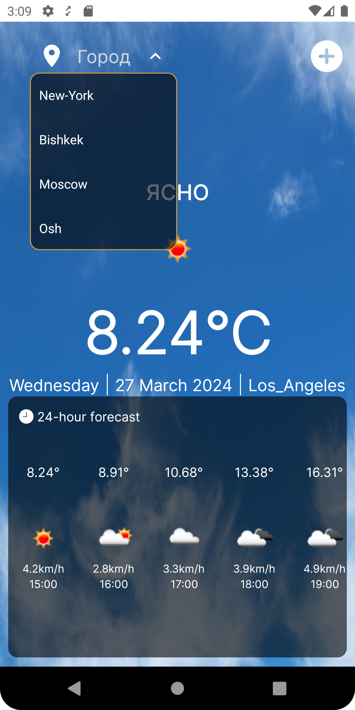
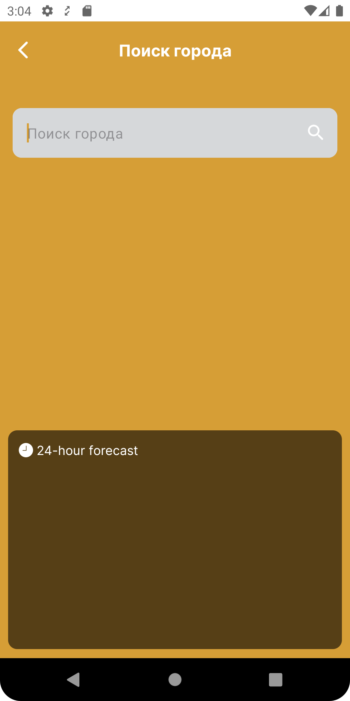
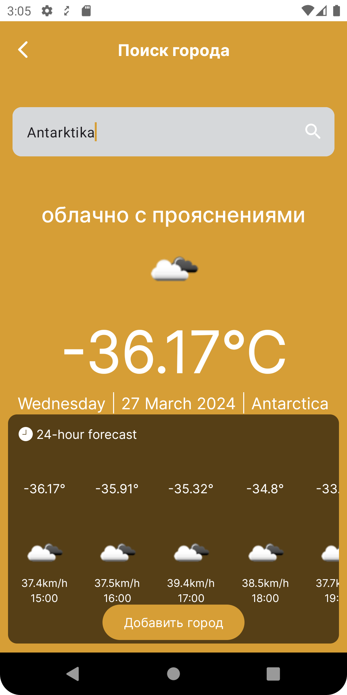
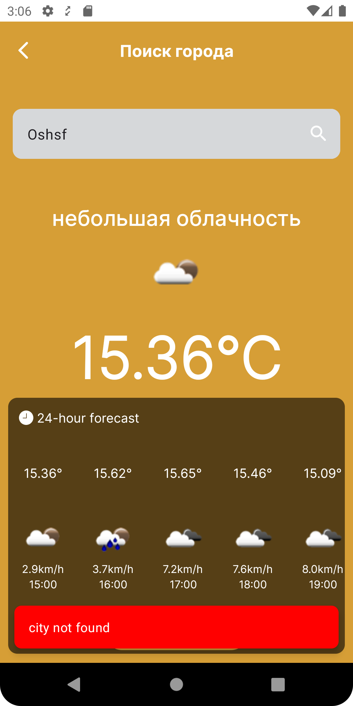

# WeatherApp

WeatherApp — это мобильное приложение для просмотра погоды в городе

### Обзор приложения

### Автоматическое отображение погоды при входе с помошью GPS









### Поиск города







### Требования

- Для Android: Требуется Android SDK с минимальным уровнем API 24.

### Установка

Клонируйте репозиторий на свою локальную машину с помощью Git:

   ```bash
   git clone https://github.com/Umut-Arpidinov/Weather-app.git
```

### Запуск

После загрузки всех зависимостей запустите приложение в эмуляторе или на физическом устройстве Android

